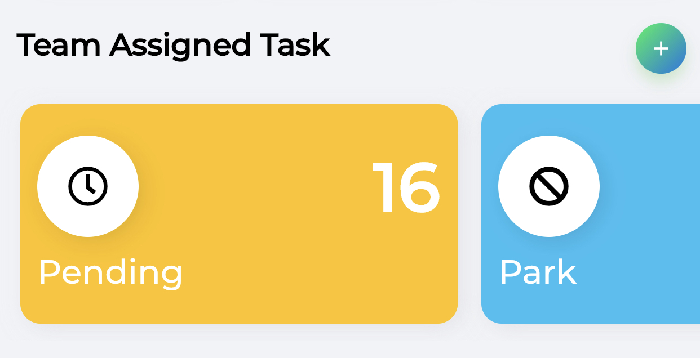

# bms_widgets

A Initial Version of widgets collection by Bright Media Solution Private Limited <www.brightmedia.in>

## Screenshots

## Usage
Add this library to your pubspec.yaml under dependencies
dependencies:
  flutter:
    sdk: flutter
    bms_widgets:

## Getting Started

This project is a starting point for a Dart
[package](https://flutter.dev/developing-packages/),
a library module containing code that can be shared easily across
multiple Flutter or Dart projects.

For help getting started with Flutter, view our 
[online documentation](https://flutter.dev/docs), which offers tutorials, 
samples, guidance on mobile development, and a full API reference.
